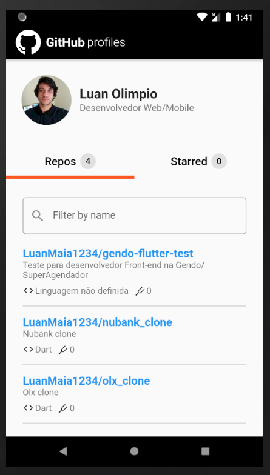
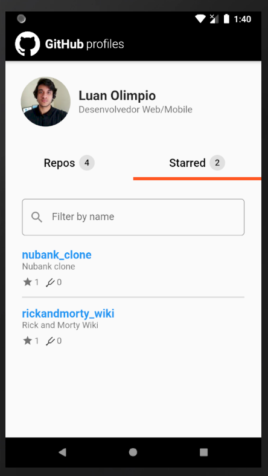

# Instalação
1. Primeiro você precisa instalar o Dart e Flutter
https://dart.dev/get-dart
https://flutter.dev/docs/get-started/install/windows

2. Faça o clone ou download desse projeto.

3. Com o projeto aberto em alguma IDE execute o comando abaixo no terminal ou clique em Packages get no Android Studio.

```bash
flutter pub get
```
4. Execute o emulador ou conecte seu celular pelo USB no computador.

5. Execute o comando abaixo no terminal para compilar o projeto ou clique no botão run no Android Studio ou Visual Studio Code Run > Start Debugging.

```bash
flutter run
```
# Imagens
 
